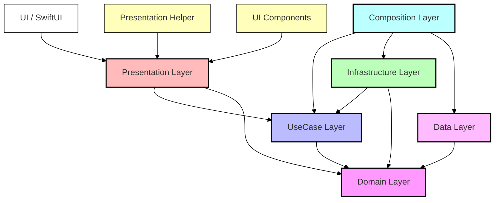
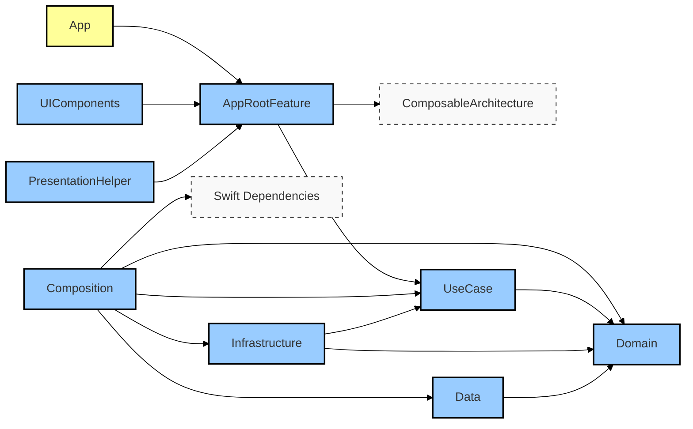

# iOS プロジェクトテンプレート

## 概要

本リポジトリは、新規iOSアプリ開発のための出発点として設計されたテンプレートプロジェクトです。クリーンアーキテクチャの原則に従い、Swift Package Managerを使用したモジュール化されたコード構造を提供します。SwiftUIとThe Composable Architecture (TCA)を採用し、保守性と拡張性に優れたアプリケーション開発を支援します。このテンプレートを使用することで、開発チームは一貫した構造でプロジェクトを素早くスタートできます。

## 特徴

- **クリーンアーキテクチャ**: Domain、Usecase、Infrastructure、Presentationの各レイヤーに明確に分離
- **SwiftUI + The Composable Architecture**: モダンなUI実装とスケーラブルな状態管理
- **Swift Package Manager**: 各機能とレイヤーをモジュール化し、依存関係を明確化
- **モジュール化**: 各レイヤーと機能を独立したSwiftパッケージとして実装し、再利用性とテスト容易性を向上
- **環境設定**: Debug、Staging、Releaseの環境設定とそれぞれに対応するスキーム
- **プライバシー**: アプリケーションのプライバシー設定に必要なPrivacy Manifestをデフォルトで導入
- **依存性注入**: Swift Dependenciesを使用した効率的な依存性管理
- **UIコンポーネント**: 再利用可能なUIコンポーネントのためのモジュールを提供

## 必要環境

- Xcode 16.0以上
- Swift 6.0以上
- iOS 15以上

## 始め方

### 新規プロジェクトの作成

このテンプレートを使用して新しいプロジェクトを開始するには、以下の手順に従ってください:

1. リポジトリをクローンする
   ```bash
   git clone https://github.com/yourusername/Training.git your-new-project
   cd your-new-project
   ```

2. セットアップスクリプトに実行権限を付与する
   ```bash
   chmod +x setup-project.sh
   ```

3. セットアップスクリプトを実行する
   ```bash
   ./setup-project.sh YourProjectName(プロジェクト名) com.yourcompany.yourprojectname(BundleID)
   ```
   
   このスクリプトは:
   - プロジェクト名を変更します
   - バンドルIDを変更します
   - スキーム名を更新します
   - プロジェクトファイルをTemplateからルートに移動します
   - 通常モードではxcworkspaceファイルを削除します
   - 新しいGitリポジトリを初期化します（通常モード時）

4. プロジェクトを開いて動作確認
   ```bash
   open YourProjectName.xcodeproj
   ```

### デバッグモード

開発中にテンプレートの動作を確認したい場合は、`--debug`フラグを使用してセットアップスクリプトを実行できます:

```bash
./setup-project.sh YourProjectName com.yourcompany.yourprojectname --debug
```

このモードでは:
- .gitディレクトリは削除されません
- セットアップスクリプト自体も削除されません
- xcworkspaceファイルが保持されます（通常モードでは削除されます）

## プロジェクト構造

```
./ (プロジェクトルート)
├── YourProjectName/            # メインソースコードディレクトリ
│   ├── App/                    # アプリケーションのエントリーポイント
│   │   ├── AppDelegate.swift   # アプリケーションデリゲート
│   │   └── YourProjectName.swift # SwiftUIアプリ構造体
│   ├── AppIcon/                # アプリアイコン
│   ├── Configurations/         # ビルド設定
│   │   ├── Debug.xcconfig      # 開発環境設定
│   │   ├── Staging.xcconfig    # テスト環境設定
│   │   └── Release.xcconfig    # 本番環境設定
│   ├── Privacy/                # プライバシー関連設定
│   │   └── PrivacyInfo.xcprivacy # Privacy Manifest
│   └── Sources/                # メインソースコード
│       ├── Composition/           # 依存性注入と構成
│       ├── Data/                  # データ層（リポジトリ実装など）
│       ├── Domain/                # ドメインレイヤー（エンティティ、リポジトリインターフェース）
│       ├── Infrastructure/        # インフラレイヤー（APIクライアント、永続化など）
│       ├── Presentation/          # プレゼンテーションレイヤー（UI、Feature、View）
│       │   ├── AppRootFeature/     # アプリのルート機能
│       │   └── 他の機能...         # 追加の機能モジュール
│       ├── PresentationHelper/    # プレゼンテーション層のヘルパー
│       ├── Resources/             # 共有リソース
│       ├── UIComponents/          # 再利用可能なUIコンポーネント
│       └── UseCase/               # ユースケースレイヤー（アプリケーションロジック）
├── YourProjectName.xcodeproj/  # Xcodeプロジェクトファイル
├── YourProjectNameTests/       # テストディレクトリ
└── YourProjectNameUITests/     # UIテストディレクトリ
```

## アーキテクチャ

このテンプレートは以下のアーキテクチャ原則に従っています:

### クリーンアーキテクチャ

アーキテクチャの依存関係は以下の図のようになっています:



各レイヤーの責務:

- **Domain**: エンティティと基本的なビジネスルールを含むコアレイヤー
- **UseCase**: アプリケーション固有のビジネスルールとDomainレイヤーの操作
- **Data**: リポジトリの実装とデータソースアクセス
- **Infrastructure**: 外部システムとの通信を担当（APIクライアント、データベース操作の実装など）
- **Presentation**: ユーザーインターフェースとユーザー入力の処理
- **UIComponents**: 再利用可能なUIコンポーネント
- **PresentationHelper**: プレゼンテーション層のヘルパーユーティリティ
- **Composition**: 依存性の注入と各レイヤーの構成

### パッケージの依存関係



## 環境設定

このテンプレートは、異なる環境のための設定ファイル（.xcconfig）を提供しています:

- **Debug.xcconfig**: 開発環境用の設定（アプリ名: テンプレート(開発)）
- **Staging.xcconfig**: テスト環境用の設定（アプリ名: テンプレート(検収)）
- **Release.xcconfig**: 本番環境用の設定（アプリ名: テンプレート）

これらの設定ファイルでは、以下のようなプロジェクト全体の設定を行うことができます:

- アプリ名
- バンドル識別子
- APIのベースURL
- その他の環境固有の設定値

## 開発ガイドライン

### 新機能の追加

1. 適切なレイヤーにコードを配置する:
   - ビジネスエンティティ → Domainレイヤー
   - ビジネスルール → UseCaseレイヤー
   - リポジトリインターフェース → Domainレイヤー
   - リポジトリ実装 → Dataレイヤー
   - 外部システム連携の実装 → Infrastructureレイヤー
   - UI → Presentationレイヤー

2. 機能ごとに新しいSwift Packageを作成することを検討する:
   ```bash
   cd Sources/Presentation
   mkdir YourNewFeature
   cd YourNewFeature
   swift package init --type library
   ```

3. 依存関係の方向に注意する:
   - Domain ← UseCase ← Infrastructure/Data/Presentation
   - Domainは他のどのレイヤーにも依存しない
   - UseCaseは下流のレイヤーに依存しない

### TCAの活用

1. 各機能に対して以下の構造を作成する:
   - Feature: アクション、状態、リデューサーを定義
   - View: SwiftUIビューとTCAストアを接続

2. 大きな機能は小さなコンポーネントに分割し、それぞれをReducerとして実装する

3. UIの表現と状態管理を明確に分離する

## テスト

各レイヤーには対応するテストターゲットが含まれています:

- DomainTests: ビジネスエンティティとビジネスルールのテスト
- UseCaseTests: ユースケースのテスト
- DataTests: リポジトリ実装のテスト
- InfrastructureTests: 外部システム連携のテスト
- 各機能のテスト: UIと連携も含めた機能のテスト

### TCAのテスト

TCAはテスト容易性を考慮して設計されており、以下のような方法でテストできます:

1. TestStoreを使用して、アクションに対する状態の変化とエフェクトをテスト
2. 依存関係をモック化して、独立したテストを実行

## リソース管理

リソースの管理には専用のResourcesモジュールを使用します:

- 画像アセット
- カラー定義
- テキストスタイル
- 他の共有リソース

## まとめ

このiOSプロジェクトテンプレートは、モダンなSwiftとSwiftUIを活用した、クリーンでモジュール化されたアーキテクチャを提供します。The Composable Architectureを採用することで、予測可能な状態管理と単方向データフローを実現し、保守性の高いアプリケーション開発を可能にします。

また、Swift Package Managerを使用したモジュール化により、コードの分離と再利用性を高め、テスト可能性を向上させています。環境別の設定ファイル（.xcconfig）を使用することで、開発、テスト、本番環境での異なる設定を簡単に管理できます。

このテンプレートは、中〜大規模のiOSアプリケーション開発に適しており、チーム開発においても各モジュールの責任範囲が明確になるため、効率的な開発が可能です。
