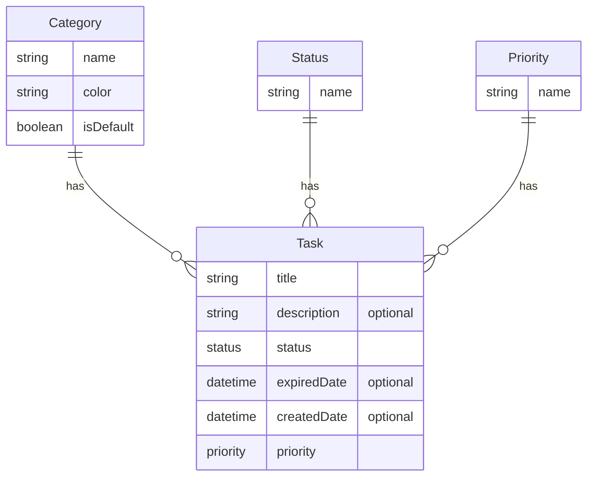

```mermaid
erDiagram
    Task {
        string title
        string description "optional"
        status status
        datetime expiredDate "optional"
        datetime createdDate "optional"
        priority priority
    }

    Category {
        string name
        string color
        boolean isDefault
    }

    Status {
        string name
    }

    Priority {
        string name
    }

    Category 1 to zero or more Task : "has"
    Status 1 to zero or more Task : "has"
    Priority 1 to zero or more Task : "has"
```