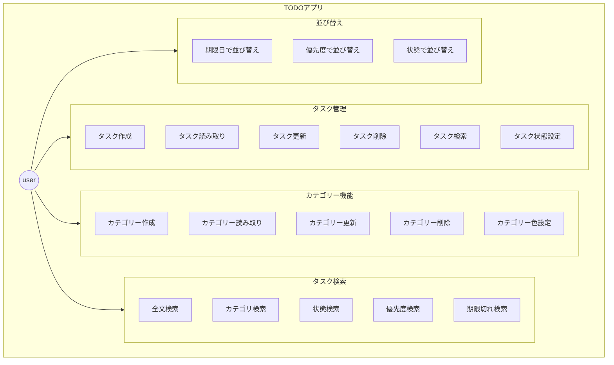

```mermaid
graph TB
    subgraph "TODOアプリ"
        User((user))
        subgraph "タスク管理"
            CreateTask[タスク作成]
            Readtask[タスク読み取り]
            UpdateTask[タスク更新]
            DeleteTask[タスク削除]
            SearchTask[タスク検索]
            SetStatus[タスク状態設定]
        end

        subgraph "カテゴリー機能"
            CreateCategory[カテゴリー作成]
            ReadCategory[カテゴリー読み取り]
            UpdateCategory[カテゴリー更新]
            DeleteCategory[カテゴリー削除]
            SetColor[カテゴリー色設定]
        end

        subgraph "タスク検索"
            SearchByText[全文検索]
            SearchByCategory[カテゴリ検索]
            SearchByStatus[状態検索]
            SearchByPriority[優先度検索] 
            SearchByDueDateExpired[期限切れ検索]
        end

        subgraph "並び替え"
            SortByDueDate[期限日で並び替え]
            SortByPriority[優先度で並び替え]
            SortByCreate[状態で並び替え]
        end
    end
    User --> タスク管理
    User --> カテゴリー機能
    User --> タスク検索
    User --> 並び替え
```